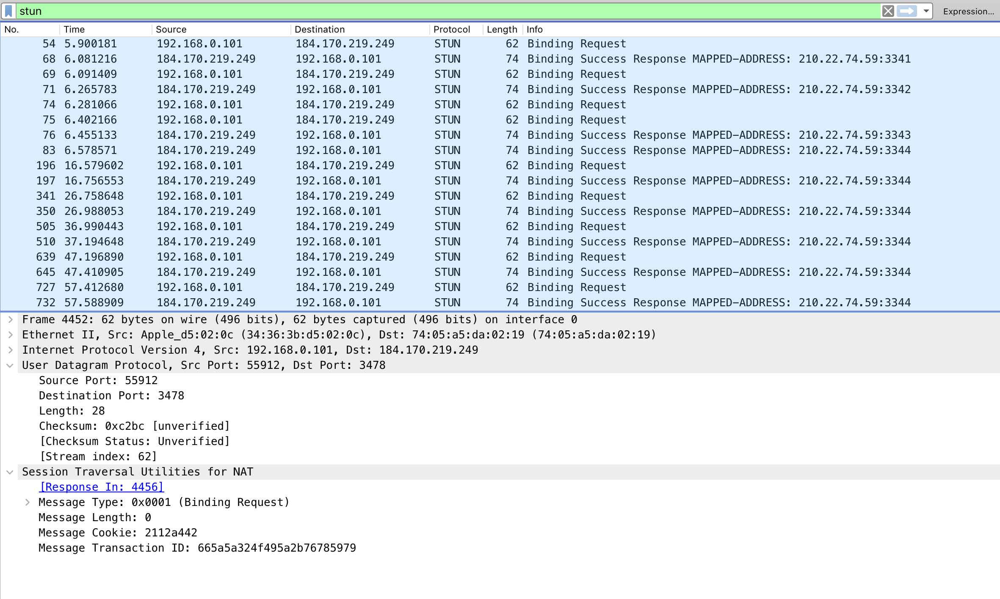

# A toy stun server

This is a toy stun server, see protocols:
- [rfc3489](https://datatracker.ietf.org/doc/html/rfc3489)
- [rfc5389](https://datatracker.ietf.org/doc/html/rfc5389)

## Intro

The complete implementation of stun server is pretty complicated, I'm not intend to do it in this project. This project is just a toy to learn how to implement the key part of stun server. Let't walk through this.

There are two protocols defining the details of stun server: rfc3489 and rfc5389. The latter just obsoletes the former, so just read rfc5389 is enough.

The key part of a stun is pretty simple: just a binding request sent from stun client and a binding response sent from stun server. Let's look at the details of this.

## Preparing test environemnt

The WebRTC code in browser have a complete stun client implementation. So let's use it to test our server. Just create a `index.html` file and copy in the below code.

```html
<!DOCTYPE html>
<html lang="en">
  <head>
    <meta charset="UTF-8" />
    <meta http-equiv="X-UA-Compatible" content="IE=edge" />
    <meta name="viewport" content="width=device-width, initial-scale=1.0" />
    <title>Document</title>
  </head>
  <body>
    <script>
      (async () => {
        const iceServers = [{ urls: "stun:stun.l.google.com:19302" }];
        // const iceServers = [{ urls: "stun:localhost:3478" }];
        const pc = new RTCPeerConnection({ iceServers });

        pc.createDataChannel("");

        pc.onicecandidate = (ice) => {
          if (!ice.candidate) return;
          console.log(ice.candidate.address);
        };

        const offer = await pc.createOffer();
        await pc.setLocalDescription(offer);
      })();
    </script>
  </body>
</html>
```

As you run this code in the browser, a stun request should be sent. In the browser console, you should see the publish IP address should be printed as expected. This is just what stun server do: find the public ip address.

As you can see, I use the google public stun server to use as a demo `stun:stun.l.google.com:19302`. When we write our toy stun server, we can change it to `stun:localhost:3478` to test our own code.

## UDP server

A stun server can use both udp and tcp, since udp is more simpler, so let's start with a udp server.

```go
func main() {
	conn, err := net.ListenPacket("udp", ":3478")
	if err != nil {
		log.Fatal(err)
	}
	defer conn.Close()

	for {
		buf := make([]byte, 1024)
		n, addr, err := conn.ReadFrom(buf)
		if err != nil {
			continue
		}
		go serve(conn, addr, buf[:n])
	}
}
```

The code is just a plain udp server, not that port 3478 is used, because it is a typical port define in the protocol.

## message header

All STUN messages MUST start with a 20-byte header followed by zero or more Attributes. 

The STUN header contains a STUN message type, magic cookie, transaction ID, and message length.

```
       0                   1                   2                   3
       0 1 2 3 4 5 6 7 8 9 0 1 2 3 4 5 6 7 8 9 0 1 2 3 4 5 6 7 8 9 0 1
      +-+-+-+-+-+-+-+-+-+-+-+-+-+-+-+-+-+-+-+-+-+-+-+-+-+-+-+-+-+-+-+-+
      |0 0|     STUN Message Type     |         Message Length        |
      +-+-+-+-+-+-+-+-+-+-+-+-+-+-+-+-+-+-+-+-+-+-+-+-+-+-+-+-+-+-+-+-+
      |                         Magic Cookie                          |
      +-+-+-+-+-+-+-+-+-+-+-+-+-+-+-+-+-+-+-+-+-+-+-+-+-+-+-+-+-+-+-+-+
      |                                                               |
      |                     Transaction ID (96 bits)                  |
      |                                                               |
      +-+-+-+-+-+-+-+-+-+-+-+-+-+-+-+-+-+-+-+-+-+-+-+-+-+-+-+-+-+-+-+-+
```

Once the server receive the binding request message, first thing should do is to check if the mesage format is valid.

```go
udpAddr, ok := addr.(*net.UDPAddr)
if !ok {
    fmt.Println("invalid remote addr: cannot convert to udp addr")
    return
}

// first two bit should be 0
if (buf[0]>>6)&1 != 0 || (buf[0]>>7)&1 != 0 {
    fmt.Printf("invalid message: %b\n", buf[0])
    return
}

// only support class request
// class request: 0b00
c1 := buf[0] & 0
c0 := (buf[1] >> 3) & 0
if (c1 != 0) || c0 != 0 {
    fmt.Printf("class not supported: c1:%d, c0:%d\n", c1, c0)
    return
}

// only support method Binding
msgType := binary.BigEndian.Uint16(buf[0:2])
if msgType != 1 {
    fmt.Printf("method not supported: %b", msgType)
    return
}

// only deal with 0 attributes now
msgLength := binary.BigEndian.Uint16(buf[2:4])
if msgLength != 0 {
    fmt.Println("msgLength not supported", msgLength)
    return
}

magicCookie := binary.BigEndian.Uint32(buf[4:8])
if magicCookie != 0x2112A442 {
    fmt.Printf("invalid magicCookie: %x\n", magicCookie)
    return
}

transactionID := buf[8:]
fmt.Println("transactionID", transactionID)
```

And then, the server should try to form the binding response, which have the same format as the binding request.

```go
func formHeader(msgLength int, transactionID *[]byte) (*bytes.Buffer, error) {
	buf := new(bytes.Buffer)

	buf.Write([]byte{0b00000001, 0b00000001})

	err := binary.Write(buf, binary.BigEndian, uint16(msgLength))
	if err != nil {
		return buf, err
	}

	err = binary.Write(buf, binary.BigEndian, uint32(0x2112A442))
	if err != nil {
		return buf, err
	}

	_, err = buf.Write(*transactionID)
	if err != nil {
		return buf, err
	}

	return buf, nil
}
```

## message attributes

The format of stun attributes is as below.

```
       0                   1                   2                   3
       0 1 2 3 4 5 6 7 8 9 0 1 2 3 4 5 6 7 8 9 0 1 2 3 4 5 6 7 8 9 0 1
      +-+-+-+-+-+-+-+-+-+-+-+-+-+-+-+-+-+-+-+-+-+-+-+-+-+-+-+-+-+-+-+-+
      |         Type                  |            Length             |
      +-+-+-+-+-+-+-+-+-+-+-+-+-+-+-+-+-+-+-+-+-+-+-+-+-+-+-+-+-+-+-+-+
      |                         Value (variable)                ....
      +-+-+-+-+-+-+-+-+-+-+-+-+-+-+-+-+-+-+-+-+-+-+-+-+-+-+-+-+-+-+-+-+
```

What we need to do here is to return a MAPPED-ADDRESS type, to tell the client it's public address.

```go
func formAttr(addr *net.UDPAddr) (*bytes.Buffer, error) {
	var err error
	buf := new(bytes.Buffer)

	// attr type
	err = binary.Write(buf, binary.BigEndian, uint16(1))
	if err != nil {
		return buf, nil
	}

	addrBuf, err := formAddr(addr)
	if err != nil {
		return buf, err
	}
	addrBytes := addrBuf.Bytes()

	err = binary.Write(buf, binary.BigEndian, uint16(len(addrBytes)))
	if err != nil {
		return buf, err
	}
	buf.Write(addrBytes)

	return buf, nil
}
```

## message attribute MAPPED-ADDRESS

MAPPED-ADDRESS should be filled the ip and port of the client, let's see the format.

```
       0                   1                   2                   3
       0 1 2 3 4 5 6 7 8 9 0 1 2 3 4 5 6 7 8 9 0 1 2 3 4 5 6 7 8 9 0 1
      +-+-+-+-+-+-+-+-+-+-+-+-+-+-+-+-+-+-+-+-+-+-+-+-+-+-+-+-+-+-+-+-+
      |0 0 0 0 0 0 0 0|    Family     |           Port                |
      +-+-+-+-+-+-+-+-+-+-+-+-+-+-+-+-+-+-+-+-+-+-+-+-+-+-+-+-+-+-+-+-+
      |                                                               |
      |                 Address (32 bits or 128 bits)                 |
      |                                                               |
      +-+-+-+-+-+-+-+-+-+-+-+-+-+-+-+-+-+-+-+-+-+-+-+-+-+-+-+-+-+-+-+-+
```

let's see the code.

```go
// form a MAPPED-ADDRESS binding response
// 8 bits of value 0 + 8-bit address family + 16-bit port + fixed-length value representing the IP address.
// If the address family is IPv6, the address MUST be 128 bits.
func formAddr(addr *net.UDPAddr) (*bytes.Buffer, error) {
	var err error
	buf := new(bytes.Buffer)

	err = buf.WriteByte(0)
	if err != nil {
		return buf, err
	}

	ipv4 := addr.IP.To4()
	if ipv4 != nil {
		err = buf.WriteByte(1)
		if err != nil {
			return buf, err
		}
		err = binary.Write(buf, binary.BigEndian, uint16(addr.Port))
		if err != nil {
			return buf, err
		}
		_, err = buf.Write(ipv4)
		if err != nil {
			return buf, err
		}
		return buf, nil
	}

	ipv6 := addr.IP.To16()
	if ipv6 != nil {
		err = buf.WriteByte(2)
		if err != nil {
			return buf, err
		}
		err := binary.Write(buf, binary.BigEndian, uint16(addr.Port))
		if err != nil {
			return buf, err
		}
		_, err = buf.Write(ipv6)
		if err != nil {
			return buf, err
		}
		return buf, nil
	}

	return buf, errors.New("Invalid ip addr: " + addr.String())
}
```

## The end

That is all the pieces we need. See the complete code in this [file](./main.go).

After you start the server, check the browser console and also check with wireshark to see if it's working properly.




